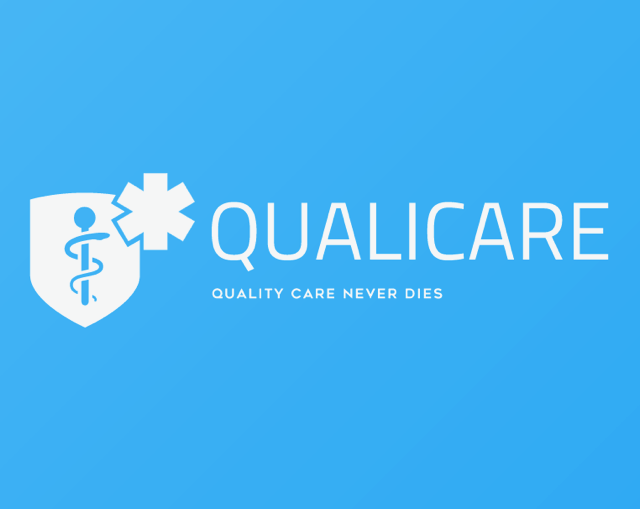
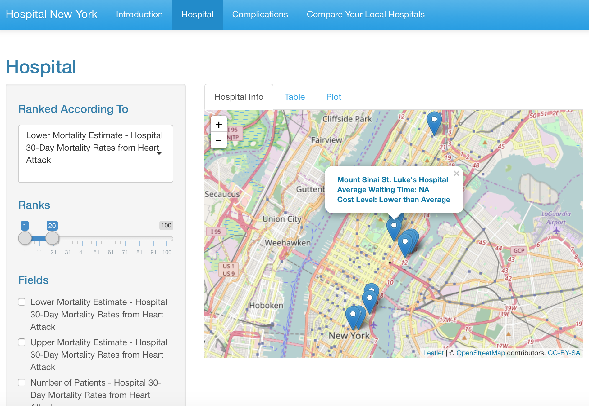

# Project 2: Open Data App - QUALICARE (based on shiny app)

### [Project Description](doc/project2_desc.md)

In this second project of GU4243/GR5243 Applied Data Science, we develop an app called QUALICARE. Exploratory Data Analysis and Visualization based on hospital Quality Indicator data based on shiny app, by using U.S. government open data released on the [data.gov](https://data.gov/) website. See [Project 2 Description](project2_desc.md) for more details.  

The **learning goals** for this project is:

- business intelligence for data science
- data cleaning
- data visualization
- systems development/design life cycle
- shiny app/shiny server

*The above general statement about project 2 can be removed once you are finished with your project. It is optional.

## New York Hospital Care
Term: Spring 2017

+ Group 9
+ **New York Hospital Care**:	
	+ Yifei Tang
	+ Vanessa Huang 
	+ Boya Zhao
	+ Jinru Xue

+ **Project summary**:Pay attention to patient safety measure for the hospital quality, based on HAI (Hospital Associated Infection), mortality estimate and main complications. Provide information, like rank and value plot about the predict mortality in last 30 days. Besides, give the radar plot about main complication may happen in the hospital. And make recommendation about the hospital based on customer's concern. Also, this app provides the visual bar plot about the history data of HAI to help customers to better decide which hospital to go.

+ **Contribution statement**: ([default](doc/a_note_on_contributions.md)) All team members contributed equally in all stages of this project. All team members approve our work presented in this GitHub repository including this contributions statement. 

